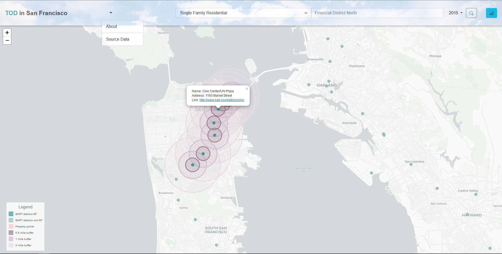
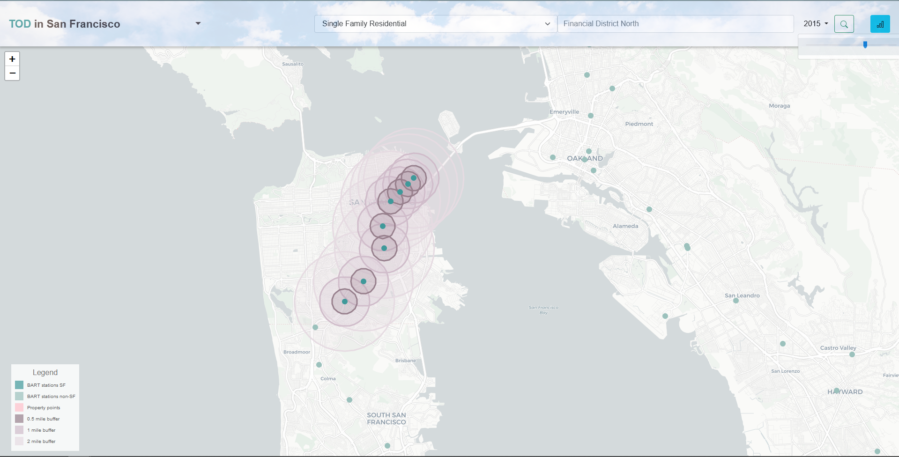
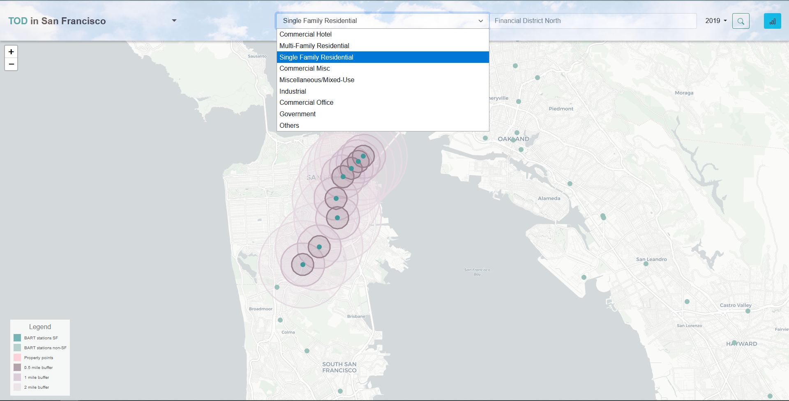
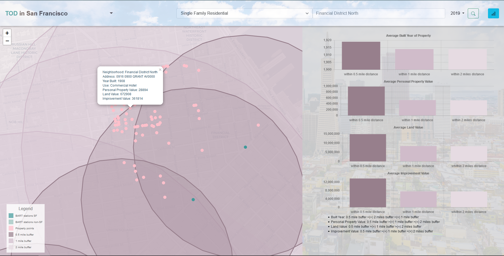

# SF-TOD-DEV
Repo for CPLN692 final project
----

## Website Functionalities:
* Purpose & Goal
    * Users could learn about the properties' details including built year, location, values, etc;
    * Users could examine the impact of TOD on property values for different properties types, neighborhoods, and tax-roll closed years;
* Functionalities
    * In-site search: based on user input, the website can fetch data from San Francisco Goverment using API;
    * Property information map: based on user input, the website can zoom into properties' locations and show the property information when user click on a property.
    * BART station location map: users can see BART station information when clicking on a station marker.
    * Comparison chart: On the collapsible sidebar, the website shows four comparison bar charts comparing property information between different TOD buffers. These includes: built year, personal property value, land value, and improvement value. Along with the charts and annotated texts, they help illustrate the impact of TOD.

## Interaction Instructions:
On homescreen, click on "start!" to enter the map application. The map shows BART stations that you can click on. The little triangle will take you to source data - property tax rolls.

To switch years, click on the year and click on the range slider.

To change property type, click on the input box (default to Commercial Hotel) and select from the dropdown menu.

Finally, type in the neighborhood of interest and hit the search icon to view result!

